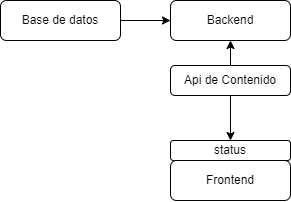
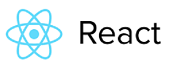
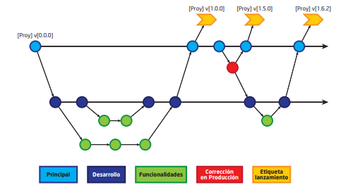

# Paginas Web  

### Herramientas para el desarrollo.
#### Pagina Actual  fisica:
+ WordPress: Contenido y blog.
+ PHP: lenguaje de programacion.
+ SO: debian.
+ My Sql: base de datos.
+ jQuery: librerias Js.
+ Servidor Web: Apache.

#### Pagina planetario: 
+ Gogle analytics: Analitica. 
+ SO: ubuntu
+ Servidor Web: Apache.
+ jQuery: libreria Js.

#### fisica unam 
+ Gogle analytics: Analitica. 
+ isotope: libreria Js.
+ jQuery: libreria Js.
+ Apache: servidor web.
+ PHP: Lenguaje de perogramacion.
+ UI Framework: ZURB Foundation, Bootstrap Animate.js

#### Instituto bailseriro.

+ Joomla: Contenido y blog.
+ PHP: Lenguaje de perogramacion.
+ Nginx: servidor web.
+ CDN : jsDelivr.
+ jQuery: libreria Js.
+ Nginx: reverse proxi.
+ UI Framework: Bootstrap

#### fisica san simon.
+ PHP: Lenguaje de perogramacion.
+ Apache: servidor web.
+ CentOs : SO.
+ Gogle analytics: Analitica. 

#### fisica uc cl 

+ PHP: Lenguaje de perogramacion.
+ Apache: servidor web.
+ CentOs : Unix.
+ Gogle analytics: Analitica. 
+ UI Framework: Bootstrap
+ jQuery: libreria Js.
+ CDN Google Hosted Libraries.
+ FrameWork JS : Mootools
+ Joomla: gestor de contenido

#### Instituto de fisica Pesquisa

+ Gogle analytics: Analitica. 
+ Drupal: gestor de contenido
+ PHP 
+ debian
+ jQuery
+ Apache

#### Universidad de Chile 

+ Framework web:
+ JavaServer Pages
+ nginx : servidor web, reverse Proxy
+ jquiery modernizr lightbox :js libray.
+ java: lenguaje de progamacion.
+ Gogle analytics: Analitica. 
+ varnish: herramienta de cache

___

## Esquema navegacional(actual )

+ Presentacion.
+ Grado
   - perfil profecional
+ Postgrado
   - pag separada
+ Investigacion
   -  Areas de investigacion
   -  publicaciones servicios 
   -  informacion 
   -  datos 
   -  enlaces
+ Interaccion social
   -  Planetario

+ planetario max schreier

+ Publicaciones 
   -  revista boliviana de fisica
+ Olimpiadas
    - examanes
    - revista de fisica 
    - enlaces 
    - convocatorias 
    - reflamenro 
    - curso 
    - planetario
+ Cursos 
    - cursos realizados y auspiciados
+ Docentes 
+ Auxiliares
+ Estudiantes
    - magia de la fisica
+ Actividades
    - Fapa
+ Autoridades
+ SOBOFI
    - Pagina externa
+ Homenaje 

***
## Lineaminetos para el desarrollo apicaciones web
 Todo proyecto de software debe contar con una estructura documental estándar. La información que esté publicada debe estar organizada sistemáticamente y ser entendible.

Existen dos tipos de categorías para organizar la documentación:
    
    1. Documentación de administración
    2. Documentación de desarrollo
    3. Documentación del código

1. Documentación de administración

Este tipo de documentación contempla aquella información relacionada específicamente con la administración del proyecto; es decir, contiene las instrucciones del cómo desplegar el proyecto en los diferentes ambientes comúnmente usados, como el de pruebas, el de desarrollo y el de producción. Así, también se refiere a la documentación que aborda temas de configuraciones y actualizaciones.

2. Documentación de desarrollo

La documentación de desarrollo es aquella que se genera desde el diseño de la solución hasta la culminación del proyecto. Dentro de esta categoría se deberá contemplar la información relacionada a la ingeniería de requerimientos, a la arquitectura y al código generado durante el desarrollo. 
 - Documentación de la Ingeniería de Requerimientos: 
    
    se refiere a toda la información generada producto de reuniones realizadas con las partes interesadas, que incluye la recopilación de procesos y requisitos del proyecto de software y todas aquellas tareas que hayan determinado las necesidades o las condiciones a satisfacer por el software a desarrollarse.
 - Documentación de la Arquitectura del Software: 
    
    se refiere a todos los criterios técnicos utilizados en el desarrollo, así como la metodología, el modelo de desarrollo, estructura de directorios, etc.

La documentación mínima sugerida para esta categoría es:
- Modelo de datos: documentación que contiene el esquema de base de datos
que utiliza el proyecto.

3. Documentación del código

Todo el código desarrollado deberá ser comentado durante su proceso para que las personas que se involucren en el proyecto puedan entenderlo.
Se deben seguir los siguientes lineamientos para la documentación del código:

- Generar la documentación del código de manera automática a través de una
herramienta.
- Aplicar la generación de documentación a los siguientes ámbitos: los segmentos de código crítico del proyecto, las funcionalidades y la API de servicios web (si aplica).
- Guardar la documentación generada en un directorio denominado “docs”,
ubicado en el directorio raíz del proyecto.
- Generar la documentación en un formato que pueda ser desplegado en la web.

Los manuales de usuario, que incluyen información de los procesos de difusión,
capacitación y comunicación, no están contemplados en esta fase debido a que
la misma será desarrollada en otra etapa del proyecto por las áreas responsables
(área de comunicación, área de recursos humanos, etc.).

### Configuracion incial

En el directorio raíz de cada proyecto deben existir los siguientes archivos:
- README.md Que contiene la descripción general del proyecto.
- INSTALL.md Describe los pasos para la instalación.
- UPDATE.md Describe los pasos para la actualización.
- LICENSE.md Licencia GPL Bolivia.
- CHANGELOG.md Para registrar los cambios entre versiones (opcional)
- .gitignore para no versionar archivos de configuración, compilados de la
aplicación y binarios grandes.

No está permitido versionar claves, contraseñas, tokens u otra información sensible.
En su lugar se puede poner datos de ejemplo.

No está permitido versionar las dependencias de código externos al software,
debiéndose usar el gestor de paquetes. Tampoco se debe versionar el software
compilado o empaquetado.

Es obligatorio que la estructura de base de datos (tablas, funciones y procedimientos
almacenados) sea versionada mediante scripts de migrations*. 

+ LINEAMIENTOS ESPECÍFICOS PARA EL DESARROLLO SEGÚN EL ÁMBITO DE USO.
    - Calidad en desarrollo web

    Las aplicaciones web tienen una serie de ventajas que han permitido ser el tipo de software que más se usa. Una de las ventajas más importantes es que no dependen de la computadora ni del sistema operativo en el que se ejecuta, y que puede ser utilizadas en cualquier parte del planeta a cualquier hora y desde diferentes dispositivos. Entre los aspectos negativos se encuentra que no es posible usar todas las funciones que pueden usarse en aplicaciones nativas. En tal sentido, listamos las mejores prácticas.
    - HTML

    Es obligado el uso de los tags de html5, dejando de lado los tags de estándares antiguos como ser el xhtml, así mismo, definir el encoding* como utf8 en las cabeceras. Es obligatorio el uso de “tags semánticos”* y metadatos, de tal forma que mejore la indexación y ordene la estructura de la página. 
    Es recomendable que no exista código javascript y css en el html, y que los archivos css sean llamados antes que los de javascript. Es obligatorio que los recursos (imágenes, archivos css y archivos javascript) sean optimizados para la web mediante procesos de minificación* o uglificación*.
    - CSS
    
    Es recomendable usar una convención de nombres para elementos css o usar una ya existente como BEM*, OOCSS* y SMACSS*. 
    
    Es recomendable usar preprocesadores de css que extienden sus funcionalidades, por ejemplo: sass*, less* y stylus*. 
    Es recomendable que exista un único archivo css donde se puedan configurar los
colores primarios, fuentes e iconos de la aplicación.
    - JAVASCRIPT
    
    Es recomendado que como mínimo se use javascript basado en el estándar ecma6 durante el desarrollo y en producción. Se requiere convertirlo a ecma5 para la compatibilidad con navegadores antiguos.
    - Seguridad

    Es obligatorio tomar en cuenta las recomendaciones de la OWASP*, reflejadas en el documento OWASP TOP 10. 
    - Accesibilidad
    
    Es recomendable que las aplicaciones web sigan las recomendaciones WCAG v2.1 nivel A .
    - Mecanismos de control
    
    Para poder validar la calidad de software web se pueden utilizar las siguientes herramientas:
    
        - Analizadores de código estático
        - Herramientas de análisis Web (Rendimiento, seguridad y validación de html)
        - Herramientas que verifiquen la compatibilidad de navegadores
        - Actividades de “code review”*
        - Revisiones QA y Seguridad

---
# Documeto del proyecto
- Nombre del proyecto : Pagina web Carrera de Fisica
- Breve descripción general : Pagina web de informacion y difucion de actividades de la carrera de fisica.
- Objetivo y alcance del proyecto : (Actualizar) la pagina de fisica para la difucion de mejor y actual informacion, Mejorando la experiencia de navegacion y uso de la pagina web.
- Titularidad del proyecto (Comité de dirección) ... 
- Lista de colaboradores del proyecto: Centro de estudiantes de la carrera

## Definir 

- [*] Reglas para el desarrollo
- [-] Reglas para la contribución
- [-] Listado de funcionalidades(especificas)
- [/] Herramientas de comunicación (listas de correo)
- [/] Canales de reporte de errores
- [-] Documentacion de diseño
- [-] Documentacion de administracion
- [-] Documentacion de desarrollo
- [-] Documentacion de codigo

# Documentacion de diseño
## Propuesta de navegacion Pagina Web

FIUMSA.EDU.BO/

- Inicio
    - Publicaciones y cursos.
    - Información Destacada (Convocatorias y anuncios).
- Acerca de la Carrera
    - Descripción: Ampliar, mapa.
    - Historia: Ampliar.
    - Administración.
    ➔ Autoridades. 
    ➔ Reglamento.
    ➔ Administrativos( Foto, lugar de trabajo, contacto).
- Docentes
    - Foto, nombre, cargo, y breve descripción.
    - Foto, nombre, cargo, breve descripción, currículum, área
de investigación, publicaciones, contacto(como en el
MIT).
- Programa Académico
    - Estudiantes de pregrado.
    - Perfil Profesional.
    - Admisiones.
    - Carga Académica semestral: Syllabus.
    - Pensum.
    - Calendario de actividades.
- Estudiantes de postgrado.
    - Maestría y Doctorado.
    - Admisiones
    - Carga Académica semestral: Syllabus.
    - Pensum.
    - Calendario de actividades.
- Cursos.
    - Cursos de sistemas complejos.
    - Cursos de física nuclear.
    - Escuela de Astronomía.
    - Talleres.
- Interacción Social
    - Planetario: ¿Qué hacen?, infraestructura, proyectos de
interacción social, personal.
    - Olimpiadas: Breve descripción(historia, premios).
    - Revista Boliviana de Física: Catálogo, información de
contactos ( Editores), tribunales, reglamentos de
publicación.
- Comunidad
    - F.A.P.A
    - Convocatorias: becas comedor, auxiliatura y centro de
estudiantes.
    - Magia de la física: Historia, encargados, contacto.
    - Centro de Estudiantes: Integrantes, proyectos,
calendario.
    - Clubes: Descripción, encargados, contacto.
    - Nuevos Postulantes: En proceso.

Contacto: redes sociales, correo, números de teléfono, dirección
(mapa).

IIF.FIUMSA.EDU.BO/

- Inicio
    - Publicaciones y cursos.
    - Información Destacada (Convocatorias y anuncios).
- Acerca del Instituto
    - Descripción: Ampliar, mapa.
    - Historia: Ampliar.
    - Administración:
    ➔ Autoridades.
    ➔ Reglamento.
    ➔ Administrativos( Foto, lugar de trabajo, contacto).
- Investigación
    - Áreas de investigación: Atmósfera, Rayos Cósmicos,
    Física Aplicada, Física Teórica y Geofísica.
    - Foto: ¿Qué hacen?, infraestructura, proyectos de
investigación, integrantes (resaltar al líder),
publicaciones recientes, laboratorios afiliados(estilo
MIT).
- Servicios
    - Servicios que proporcionan los laboratorios.
- Seminarios y cursos.
- Biblioteca
    - Revistas Electrónicas: revista Boliviana, suscripción a
revista internacional.
    - Motores de búsqueda: Página de la Biblioteca.
- Estudia con Nosotros: página de la carrera.

Contacto: redes sociales, correo, números de teléfono, dirección
(mapa).

---

### Wireframes & Mockups
>Es un boceto donde se representa visualmente, de una forma muy sencilla y esquemática la estructura de una página web. 
 
Test- revison

### Maquetación web 
>El diseño de una web en un conjunto de archivos (html, css y js) para que los navegadores web puedan interpretarlos y reproducirlos correctamente en diferentes dispositivos.

### Colores
+ bg-primario		Color primario
+ bg-primary-focus		Color primario - enfocado
+ bg-contenido primario		Color de contenido de primer plano para usar en el color primario
+ bg-secundario		Color secundario
+ bg-secundario-foco		Color secundario - enfocado
+ bg-contenido-secundario		Color de contenido de primer plano para usar en el color secundario
+ bg-acento		Acentuar el color
+ bg-accent-focus		Color de énfasis - enfocado
+ bg-accent-content		Color de contenido de primer plano para usar en el color de énfasis
+ bg-neutro		color neutro
+ bg-neutral-focus		Color neutro - enfocado
+ bg-neutral-contenido		Color de contenido de primer plano para usar en color neutro
+ bg-base-100		Color base de la página, utilizado para fondos en blanco
+ bg-base-200		Color base, un poco más oscuro.
+ bg-base-300		Color base, aún más oscuro
+ bg-base-contenido		Color de contenido de primer plano para usar en el color base
+ bg-info		Color de información
+ bg-éxito		color de exito
+ bg-advertencia		Color de advertencia
+ bg-error		color de error
# Dodumentacion de Desarrollo
## Administracion de Dominios
- Dominio fiumsa
- Subdominio iif/fiumsa

## Listado de Funcionalidades 
- Listado de funcionalidades: 
    - Administrar informacion de la carrera.
    - Publicar noticias.
    - Realizar convocatorias.
    - Distribuir Contenido Generado por la carrera.
## Arquitectura

***
## Tecnologias

### frontend
+ Estilos 
https://tailwindcss.com/

+ Framework
https://es.reactjs.org/

### backend
+ Headless CMS
https://strapi.io/

***
# Reglas para la contribución
## Esquema de desarrollo por ramas

- Rama Principal: Es la rama central del proyecto y contiene las versiones
candidatas para la puesta en producción de un proyecto de software.
- Rama de desarrollo: Es la rama de la versión estable en desarrollo; contiene la última versión del proyecto de software.
- Ramas de Funcionalidades: Son ramas creadas con la finalidad de desarrollar una característica o funcionalidad del proyecto, pueden estar asociadas a requisitos del proyecto o historias de usuarios para diferenciarlas de las ramas principal y de desarrollo.
- Correcciones en producción: Esta rama es de uso excepcional; su finalidad es corregir posibles errores en producción, los cuales requieren soluciones inmediatas. Esta rama debe ser obtenida de la rama principal y una vez solucionado el error debe unirse a la misma y a la rama de desarrollo.
- Etiqueta de lanzamiento: Para la generación de estas etiquetas, se ejecutan pruebas sobre la versión de archivos de la rama principal; esta versión de archivos es sometida a pruebas unitarias, de integración, de funcionalidades, además de revisión de calidad del código.

***

### Seleccion de Contenido
- Datos estaticos.
- Dependencias de datos.
- Datos dinamicos.
### Test de usabilidad
- Contrastes
- Tamaños
- Complejidad
### Compatibilidad
- Telefonos Celulares
- Tablets
- Escritorio
- Sistemas operativos - Navegadores
### Traduccion
Tablas de traduccion
- Ingles 

## Mantenimiento y actualizaciones 
- Software libre (contibuciones con el reglamento y test) 

